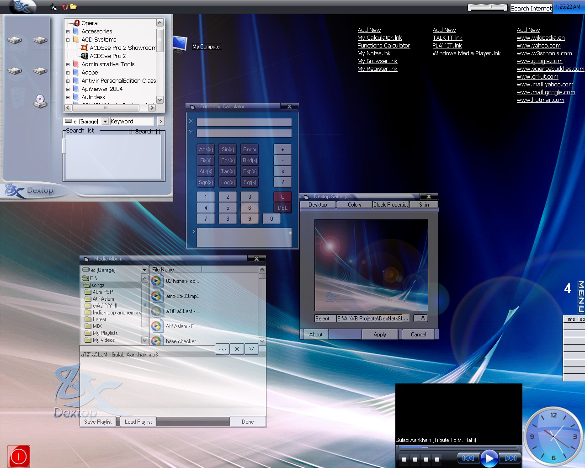



## Teacher Friendly Dextop \[TFD\] \[Update 2: Major Additions\]

### Description

[See Screenshot] Next Generation shell replacement. TFD is most impressive dextop on history of PSC. Using most Hi-Fi functions and technologies of today TFD gives best performance and kilos of functions on normal PC. TFD is complete Media Dextop. New features are enhanced security and Teacher friendly interference. Please vote I have done a lot of hard work for this.

Update:1 ['control.ocx' bug fix, other minor bugs fixed]

Update 2: Added stretching to wallpaper, preview and login screen, added Root Style programs view in start menu, Added a cool Functions Calculator which can be accessed from dextop links, Changed the Skin, Reduced the size of zip to 2.4MB by removing junk files.
 
### More Info
 

             |
---                |---
**Submitted On**   |2008-09-12 15:43:30
**By**             |[Xelon Labs](https://github.com/Planet-Source-Code/PSCIndex/blob/master/ByAuthor/xelon-labs.md)
**Level**          |Intermediate
**User Rating**    |4.7 (33 globes from 7 users)
**Compatibility**  |VB 6\.0
**Category**       |[Complete Applications](https://github.com/Planet-Source-Code/PSCIndex/blob/master/ByCategory/complete-applications__1-27.md)
**World**          |[Visual Basic](https://github.com/Planet-Source-Code/PSCIndex/blob/master/ByWorld/visual-basic.md)
**Archive File**   |[Teacher\_Fr2126669122008\.zip](https://github.com/Planet-Source-Code/xelon-labs-teacher-friendly-dextop-tfd-update-2-major-additions__1-71049/archive/master.zip)

